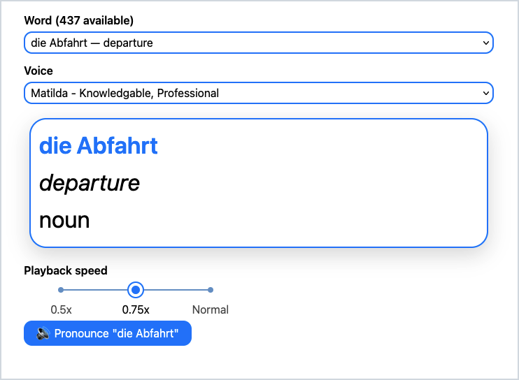

# Word Pronunciation POC

A small proof of concept: pick a German word from Crosslex's real word
dataset, and hear it pronounced via the ElevenLabs Text-to-Speech API.



## What this demonstrates

- Integrating the [ElevenLabs TTS API](https://elevenlabs.io/docs/api-reference/text-to-speech)
  (`eleven_multilingual_v2` model) to pronounce arbitrary German text.
- **The API key stays server-side, in dev mode.** A Vite dev-server
  middleware (`server/elevenLabsProxy.ts`) holds the key and exposes
  same-origin `POST /api/tts` / `GET /api/voices`; the client only ever
  calls those, never `api.elevenlabs.io` directly — every reference to
  the key in this package is confined to that one file. Open the
  browser's network tab and check for yourself. Two honest limits on
  that claim: it only holds under `yarn dev` (the proxy is a
  `configureServer` hook, which doesn't run in a static build — see
  Architecture below); and ElevenLabs' own error responses are
  forwarded to the client as-is, so if their API ever echoed a
  submitted key back in an error body — not something I've tested for —
  that's the one path unaccounted for.
- Reusing real production code from the monorepo: the actual `WordIntro`
  UI component (`@whitelotus/front-entities`) and the actual 400+ word
  Crosslex dataset (`@whitelotus/mock-test`), not mocked/fake data.
- A simple client-side cache (`src/ttsClient.ts`) so re-clicking the same
  word doesn't re-spend API quota.

## Running it

From the monorepo root (`website/`):

```bash
yarn install                                    # once, at the repo root
cd sites/pronunciation-poc
cp .env.example .env.local                      # then add your ELEVENLABS_API_KEY
yarn dev
```

Open the printed local URL, pick a word from the dropdown, and press the
pronounce button.

Get an API key at <https://elevenlabs.io/app/settings/api-keys> (free tier
works fine for this demo).

**If your key is scoped to Text-to-Speech only** (the more security-conscious
choice, and what this POC's `.gitignore`d key should probably be): voice
auto-discovery (below) needs the Voices-read scope, so it will 401 for a
restricted key. Set `ELEVENLABS_VOICE_ID` in `.env.local` instead — copy a
voice ID from the **Voices** tab in the ElevenLabs dashboard (each voice's
menu has a "Copy Voice ID" option) — and restart `yarn dev`.

## Architecture

```
sites/pronunciation-poc/
├── server/elevenLabsProxy.ts   ← Vite plugin: POST /api/tts middleware (server-only, holds the key)
├── src/
│   ├── App.tsx                 ← dropdown + WordIntro display + pronounce button
│   ├── ttsClient.ts             ← client fetch wrapper + per-word audio cache
│   └── main.tsx
├── .env.example                 ← copy to .env.local (gitignored)
└── vite.config.ts               ← registers the proxy plugin, aliases workspace packages
```

The `configureServer` hook only runs under `vite dev` (not `vite preview`
or a static build) — that's intentional for a local demo like this; a real
deployment would move the proxy into an actual backend service.
